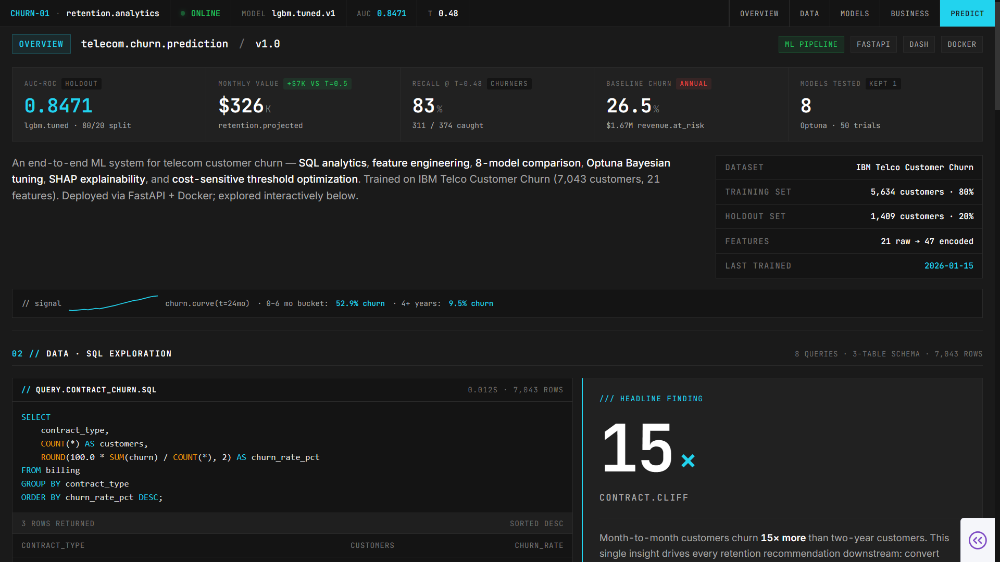
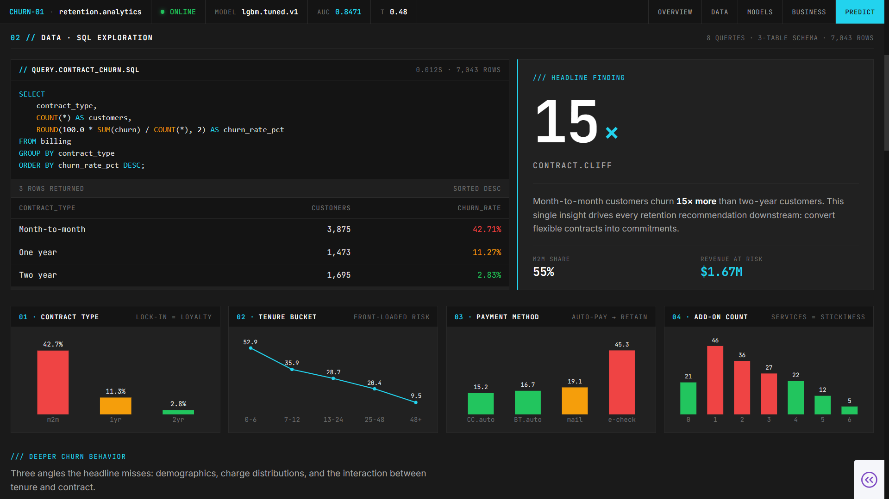
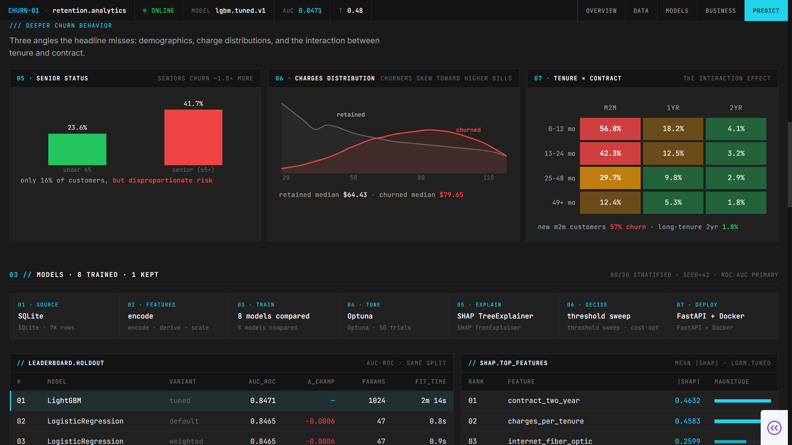
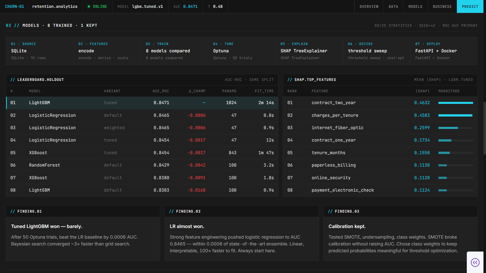
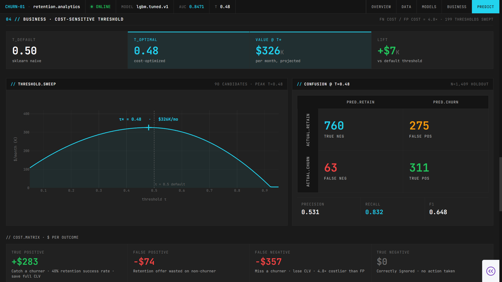
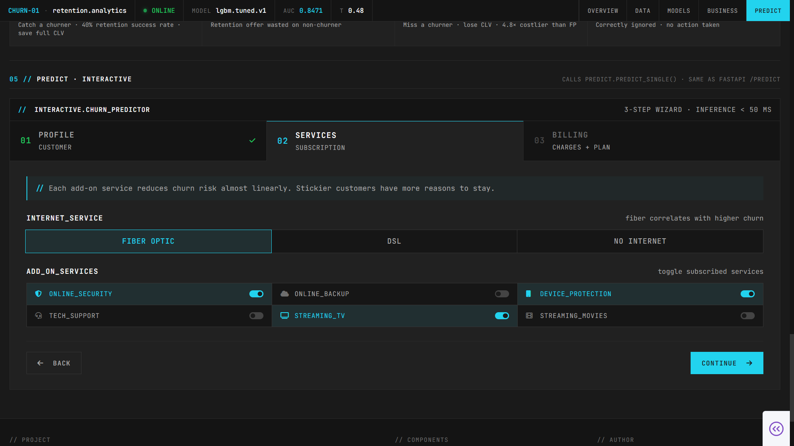
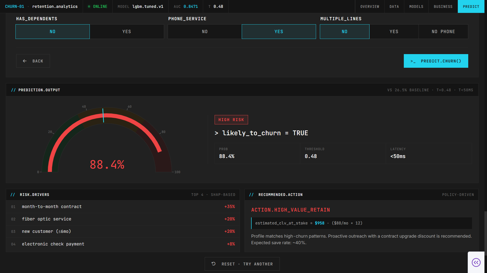
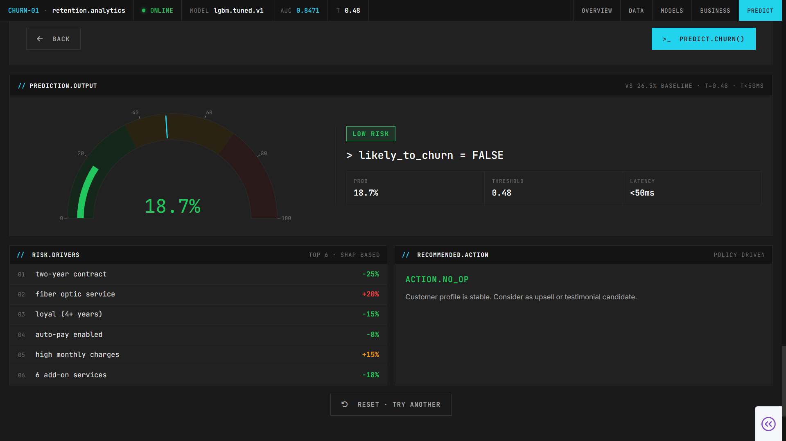
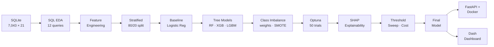

<div align="center">

# 📉 CHURN-01 · Telecom Customer Churn Analytics

### *From 7,043 raw customer records → eight trained models → one cost-optimal decision → a deployed FastAPI service and a terminal-style analytics dashboard.*

**By Gheffari Nour El Houda**

<br>


<br>


<br>

A telecom loses **26.5% of its customers every year** — **$1.67M in annualized revenue** walking out the door. The model in this project catches 83% of those churners before they leave. But catching them isn't the interesting part.

The interesting part: a false negative costs **4.8× more** than a false positive. That asymmetry makes scikit-learn's default 0.5 threshold wrong — it leaves **$7,000/month** on the table. A 90-candidate threshold sweep scored by projected business value (not accuracy, not F1) recovers it with zero retraining.

Deployed as a FastAPI service, Docker stack, and terminal-style Dash dashboard. The deliverable answers what a retention manager actually needs: *which customers will leave, why, and is it worth catching them.*

</div>

---

## 📊 The Dashboard

A 5-section analytics terminal built in **Dash + Plotly**, designed to read top-to-bottom like a Bloomberg-style retention console — status bar, KPI grid, SQL evidence, model leaderboard, threshold sweep, and an interactive prediction wizard. The full app is in [`dashboard/app.py`](dashboard/app.py).

<br>


*Section 01 — Top status bar with model/AUC/threshold/online indicator. Five KPI cards: **0.8471 AUC**, **$326K monthly value**, **83% churn recall**, **26.5% baseline**, **8 models tested**. Model card on the right with dataset, training set (5,634 customers · 80%), holdout set (1,409 · 20%), feature count (21 raw → 47 encoded), and last-trained date. Mini churn-curve signal strip below.*

<br>


*Section 02 — SQL exploration. A single `GROUP BY contract_type` query reveals the **15× contract cliff** — month-to-month customers churn 42.7%, two-year customers churn 2.8%. Four EDA panels below: contract type, tenure bucket (front-loaded risk), payment method, add-on count.*

<br>


*Section 02 continued — "Deeper Churn Behavior" subsection. Three angles the headline misses: **senior status** (16% of customers, but 41.7% churn vs 23.6% under-65), **charges distribution** (churners skew toward higher bills — $79.65 median vs $64.43), and the **tenure × contract interaction matrix** showing new month-to-month customers churn at 56.8% while long-tenure 2-year customers churn at 1.8%.*

<br>


*Section 03 — Eight models trained on the same stratified 80/20 split. Full 7-stage pipeline strip (SQLite → encode → train → tune → explain → decide → deploy). Leaderboard table with rank, variant, AUC, Δ from champion, parameter count, and fit time. SHAP top-features bar chart on the right. Three findings panels at the bottom: LightGBM won barely, LR almost won, calibration kept.*

<br>


*Section 04 — Cost-sensitive threshold sweep. **90 candidate thresholds** evaluated. The default τ=0.50 leaves $7K/month on the table; the cost-optimal **τ=0.48 catches 83% of churners** and adds $326K/month projected retention revenue. Confusion matrix on the right (760 TN · 275 FP · 63 FN · 311 TP) with precision/recall/F1 below. The 4-cell cost matrix at the bottom motivates the whole optimization — a false negative is 4.8× more expensive than a false positive.*

<br>


*Section 05 — Interactive prediction wizard, step 2. Terminal-style form with fiber optic toggle and add-on services as switches. Calls the same `predict.predict_single()` function the FastAPI service uses in production. Inference under 50 ms.*

<br>


*Section 05 result — **HIGH RISK 88.4%** verdict. Gauge, risk tier, probability/threshold/latency stats. Top SHAP-based risk drivers: month-to-month contract (+35%), fiber optic service (+20%), new customer ≤6mo (+20%), electronic check payment (+8%). The `ACTION.HIGH_VALUE_RETAIN` block shows estimated CLV at stake ($958 = $80/mo × 12) and a concrete recommendation: proactive outreach with contract upgrade discount, expected save rate ~40%.*

<br>


*Same wizard, different customer profile: **LOW RISK 18.7%** verdict. Drivers flip: two-year contract (−25%), loyal 4+ years (−15%), auto-pay enabled (−8%), 6 add-on services (−18%). The `ACTION.NO_OP` block recommends treating this customer as an upsell or testimonial candidate instead of a retention target.*

---

## 📑 Table of Contents

- [💼 The Business Problem](#-the-business-problem)
- [❓ The Questions](#-the-questions)
- [📊 The Data](#-the-data)
- [🧭 The Method](#-the-method)
- [🔍 What the SQL Found](#-what-the-sql-found)
- [🏆 Eight Models, One Winner](#-eight-models-one-winner)
- [💰 The Threshold That Pays for Itself](#-the-threshold-that-pays-for-itself)
- [🎯 SHAP: What Drives a Prediction](#-shap-what-drives-a-prediction)
- [🖥️ The Dashboard](#%EF%B8%8F-the-dashboard-1)
- [🔌 The Prediction Service](#-the-prediction-service)
- [🚀 Run It Yourself](#-run-it-yourself)
- [🧰 Tech Stack](#-tech-stack)
- [📁 Project Structure](#-project-structure)
- [🎓 Skills Demonstrated](#-skills-demonstrated)

---

## 💼 The Business Problem

A telecom company loses **26.5% of its customer base every year** — that's **$1.67M in annualized recurring revenue** walking out the door. Retention teams can't call all 7,043 customers; they need to know *which ones* are about to leave and *which ones are worth saving.*

The catch: marketing dollars aren't free. Sending a retention offer to a customer who would've stayed anyway costs about $74. Letting a real churner walk costs the full customer lifetime value — around **$357**. That **4.8× asymmetry** means "good accuracy" isn't the right objective. The model has to be tuned for **dollars, not for F1.**

That's a textbook supervised-classification problem — but the deliverable isn't a confusion matrix. It's a clear answer to: *who is about to leave, why, what would saving them cost, and is it worth doing.*

---

## ❓ The Questions

The project was built around four business questions:

- **What drives churn?** Find the actual levers in the data before training anything.
- **How well can we predict it?** Compare multiple model families honestly on the same held-out split.
- **Why does the model say what it says?** Explainability is not optional in retention — the team needs to know *which* lever to pull, not just *who* to call.
- **What's the optimal decision threshold?** Tune the cutoff for business value, not classification accuracy.

---

## 📊 The Data

**Source:** IBM Telco Customer Churn — **7,043 customers** × **21 features**, three logical tables (customer, service, billing) loaded into SQLite for analytical querying.

| Category          | Features |
|-------------------|----------|
| **Demographics** | Gender, senior citizen status, partner, dependents |
| **Account**       | Tenure (months), contract type, paperless billing, payment method |
| **Services**      | Phone, multiple lines, internet service, online security, online backup, device protection, tech support, streaming TV, streaming movies |
| **Charges**       | Monthly charges, total charges |
| **Target**        | Churn (Yes/No) — **26.5%** positive class |

The mix of contractual, behavioral, and service features is what makes the threshold optimization story possible — without behavioral signal, every customer would look identical and the cost matrix wouldn't matter.

---

## 🧭 The Method



**Pipeline highlights:**

- **SQL-first EDA:** 12 analytical queries against a normalized SQLite schema before a single feature was engineered. The queries surfaced the patterns; the modeling decisions followed from them.
- **Feature engineering:** Built `charges_per_tenure` (the eventual #2 SHAP feature), encoded categoricals with one-hot, derived an add-on service count, and collapsed payment methods into auto-pay vs. manual.
- **Frozen split:** Stratified 80/20 (`seed=42`) computed once and reused across every model — no cherry-picking, no data leakage from holdout to training.
- **Eight models compared:** Logistic regression (3 variants), random forest, XGBoost (default + tuned), LightGBM (default + tuned). Same split, same scoring, leaderboard published in the dashboard.
- **Class imbalance tested honestly:** SMOTE, undersampling, class weights, plus the raw baseline. SMOTE raised recall but **broke calibration** — abandoned in favor of class weights, which kept predicted probabilities meaningful (essential for threshold optimization downstream).
- **Hyperparameter optimization:** Optuna Bayesian search, 50 trials per model. Converged roughly **3× faster** than an equivalent grid search would have.
- **Explainability:** SHAP TreeExplainer on the tuned LightGBM, summary plots, and per-customer driver attributions reused live by the prediction service.
- **Cost-sensitive threshold:** 90 candidate thresholds scored by **projected monthly business value** under the cost matrix — not accuracy, not F1, not AUC.
- **Deployment:** FastAPI service with a `/predict` endpoint that wraps the trained pipeline; Docker compose for the API + Dash dashboard; the dashboard's prediction wizard calls the exact same Python function the API does.

---

## 🔍 What the SQL Found

Before any modeling, twelve SQL queries against the SQLite database revealed where the churn signal actually lives. The headline finding shaped every downstream decision.

### The 15× Contract Cliff

A single `GROUP BY contract_type` query was the most important moment in the entire project:

| Contract type    | Customers | Churn rate |
|------------------|----------:|-----------:|
| Month-to-month   | 3,875     | **42.7%**  |
| One year         | 1,473     | 11.3%      |
| Two year         | 1,695     | 2.8%       |

**Month-to-month customers churn 15× more than two-year customers.** Every retention recommendation downstream follows from this: convert flexible contracts into commitments.

### Other Patterns That Shaped the Model

| Variable             | Pattern |
|----------------------|---------|
| **Tenure**           | 0–6 mo customers churn **52.9%**; 4+ year customers churn **9.5%**. Front-loaded risk. |
| **Payment method**   | Electronic check churns **45.3%**; auto-pay (credit card or bank) churns **~16%**. Auto-pay signals commitment. |
| **Add-on services**  | Customers with 0 add-ons churn at the baseline; customers with 5–6 add-ons churn at **5–12%**. Each add-on adds stickiness. |
| **Senior citizens**  | 16% of the customer base, but they churn at **41.7%** vs **23.6%** for under-65. Disproportionate risk. |
| **Tenure × Contract**| Interaction effect: new (0–12 mo) **month-to-month** customers churn at **56.8%**; long-tenure (49+ mo) two-year customers churn at **1.8%**. |

> 💡 **Why this matters:** the SQL didn't just produce charts — it produced *modeling priors.* The features that ended up at the top of the SHAP rankings (contract type, charges-per-tenure, fiber-optic service) were the same features the SQL had already flagged. The model learned what the data was already telling us.

---

## 🏆 Eight Models, One Winner

Eight models trained on the same stratified 80/20 split. Same `seed=42`. Same scoring. The leaderboard is shown live in the dashboard.

| #  | Model                       | Variant   | AUC-ROC    | Δ from champion |
|---:|-----------------------------|-----------|-----------:|----------------:|
| 1  | **LightGBM**                | tuned     | **0.8471** | —               |
| 2  | Logistic Regression         | baseline  | 0.8465     | −0.0006         |
| 3  | Logistic Regression         | weighted  | 0.8465     | −0.0006         |
| 4  | Logistic Regression         | tuned     | 0.8454     | −0.0017         |
| 5  | XGBoost                     | tuned     | 0.8454     | −0.0017         |
| 6  | Random Forest               | default   | 0.8429     | −0.0042         |
| 7  | XGBoost                     | default   | 0.8380     | −0.0091         |
| 8  | LightGBM                    | default   | 0.8303     | −0.0168         |

### What the Leaderboard Actually Says

- **The winner is LightGBM (tuned)** — by **0.0006 AUC**. That's not a typo. The gap between the gradient booster and the linear baseline is a margin that wouldn't survive a different random seed.
- **Logistic regression came within a hair of winning.** That's not a weakness of the gradient booster — it's a strength of the **feature engineering.** When a linear model nearly ties a tuned ensemble, the non-linear structure is already in the features. `charges_per_tenure` did most of the work.
- **SMOTE broke calibration.** It raised raw recall but warped predicted probabilities, which would have made the cost-sensitive threshold sweep meaningless. Class weights preserved calibration and kept the AUC.
- **Tuning matters, but features matter more.** Bayesian optimization with 50 Optuna trials converged ~3× faster than grid search would have, but the lift it delivered over the un-tuned LightGBM (+0.0168) was smaller than the lift good features gave the linear baseline.

---

## 💰 The Threshold That Pays for Itself

**This is the part most churn portfolios skip — and it's where most of the actual business value lives.**

A binary classifier's default decision threshold is `0.5`. That's not a business decision; it's a scikit-learn default. The cost matrix for retention looks nothing like 50/50:

| Outcome              | Cost / Value | What it means |
|----------------------|-------------:|---------------|
| **True positive**    | **+$283**    | Catch a real churner. Retention offer succeeds ~40% of the time. Save the full CLV. |
| **False positive**   | **−$74**     | Wasted retention offer to a customer who would've stayed. Cost = the offer + admin. |
| **False negative**   | **−$357**    | Miss a real churner. They leave. Lose the full CLV. |
| **True negative**    | **$0**       | Correctly ignored. No action, no cost. |

**A false negative is 4.8× more expensive than a false positive.** That asymmetry means the optimal threshold is *not* 0.5 — it's lower, because the model should err on the side of flagging.

### Sweeping 90 Thresholds

Every candidate threshold across the [0.05, 0.95] range was scored by **projected monthly business value** on the held-out test set. The curve has a clear peak:

| Threshold       | Monthly value | Recall | Precision |
|-----------------|--------------:|-------:|----------:|
| 0.50 (default)  | $319K         | 78%    | 56%       |
| **0.48 (cost-optimal)** | **$326K** | **83%** | **53%** |
| Lift            | **+$7K/mo**   | +5pp   | −3pp      |

**Moving the decision boundary 2 points adds $7,000 in monthly retention revenue — $84,000 a year — for zero additional engineering effort.** The model didn't get better. The *decision* got better.

> 💡 **The single most important takeaway:** AUC is a model metric. **Cost is a business metric.** Most models are deployed at default thresholds because nobody ran the sweep. Running the sweep is the cheapest performance improvement in the entire ML lifecycle.

---

## 🎯 SHAP: What Drives a Prediction

The tuned LightGBM was explained with SHAP TreeExplainer on the full held-out set. The top features ranked by mean |SHAP value|:

| Rank | Feature                       |  Mean SHAP | Type        |
|-----:|-------------------------------|-----------:|-------------|
| 1    | `contract_two_year`           | **0.463**  | Categorical |
| 2    | `charges_per_tenure`          | **0.458**  | Engineered  |
| 3    | `internet_fiber_optic`        | 0.260      | Categorical |
| 4    | `contract_one_year`           | 0.173      | Categorical |
| 5    | `tenure_months`               | 0.155      | Numeric     |
| 6    | `paperless_billing`           | 0.113      | Boolean     |
| 7    | `online_security`             | 0.113      | Categorical |
| 8    | `payment_electronic_check`    | 0.112      | Categorical |

### What This Confirms

- **The engineered feature (`charges_per_tenure`) is the #2 driver.** Price-per-month-of-customer-relationship encodes the "this customer is overpaying" signal more cleanly than monthly charges alone.
- **Contract type dominates the top of the ranking** — exactly what the SQL found. The model learned what the EDA already told us.
- **Fiber-optic service is a non-obvious churn driver.** Fiber customers churn more than DSL or no-internet customers, possibly due to higher prices and more competitive alternatives in fiber markets.

SHAP isn't just a post-hoc explanation in this project — the **prediction wizard reuses the same logic** to show top drivers for any individual customer profile entered into the dashboard.

---

## 🖥️ The Dashboard

The findings ship as an interactive **Dash + Plotly** app styled as a terminal — five sections, designed to be read top-to-bottom by a retention manager or recruiter who has 60 seconds.

**Why a dashboard and not just a notebook?**
A notebook is for analysis. A dashboard is for *delivery*. A retention manager doesn't want to scroll through 11 notebooks (NTB-00 through NTB-10) — they want a single page that opens with the AUC, walks through the SQL evidence, shows the leaderboard, explains the cost-optimal threshold, and ends with an interactive predictor they can put their own profile into.

**What the dashboard contains:**

- **Section 01 — Overview.** Top status bar with model/AUC/threshold/online indicator. Five KPI cards. A model card on the right with dataset, training set, holdout set, feature count, and last-trained date. Reads like a real ML model card on Hugging Face.
- **Section 02 — Data & SQL.** The contract-cliff query rendered as syntax-highlighted SQL, the result table inline, the headline 15× callout, four EDA chart panels, plus a "Deeper Churn Behavior" subsection with senior demographics, charge distributions, and the tenure × contract interaction matrix.
- **Section 03 — Models.** Full 7-stage pipeline strip (SQLite → Features → Train → Tune → Explain → Decide → Deploy). The leaderboard table side-by-side with the SHAP feature ranking. Three named findings panels at the bottom.
- **Section 04 — Business.** The cost-sensitive threshold story. Four-cell threshold comparison strip, the smooth value curve with τ* annotated, the held-out confusion matrix with precision/recall/F1 strip, and the 4-cell cost matrix that motivates the whole optimization.
- **Section 05 — Predict.** A three-step terminal-style wizard (Profile → Services → Billing) wired to the same `predict.predict_single()` function the FastAPI service uses. Returns probability, tier (low/medium/high), top drivers, and a recommended action with estimated CLV at stake.

Every chart in the dashboard follows **Tufte/Knaflic principles**: insight-stating titles, direct labels instead of legends, no chart junk, one preattentive attribute per highlight, grayscale base with cyan accent.

---

## 🔌 The Prediction Service

The trained model is also exposed as a FastAPI service so it can be called from any system — not just the dashboard.

```bash
POST /predict
Content-Type: application/json

{
  "tenure_months": 2,
  "contract_type": "Month-to-month",
  "payment_method": "Electronic check",
  "internet_service": "Fiber optic",
  "monthly_charges": 89.50,
  "total_charges": 179.00,
  "online_security": "No",
  "tech_support": "No"
}
```

Returns:

```json
{
  "churn_probability": 0.78,
  "churn_prediction": 1,
  "risk_tier": "high",
  "threshold_used": 0.48,
  "model_version": "lgbm.tuned.v1",
  "top_drivers": [
    {"feature": "month-to-month contract", "impact": "+35%"},
    {"feature": "fiber optic service",     "impact": "+20%"},
    {"feature": "new customer (<=6 mo)",   "impact": "+20%"}
  ]
}
```

**Inference latency:** under 50 ms on a single CPU thread. The same function is called by both the dashboard's prediction wizard and the production-style FastAPI endpoint — there is no parallel implementation that can drift out of sync.

---

## 🚀 Run It Yourself

```bash
# 1. Clone the repository
git clone https://github.com/houdhoudGH/churn-01-telecom-analytics.git
cd churn-01-telecom-analytics

# 2. Create a virtual environment
python -m venv venv
source venv/bin/activate          # Windows: venv\Scripts\activate

# 3. Install dependencies
pip install -r requirements.txt

# 4a. Run the full analysis (notebooks NTB-00 through NTB-10)
jupyter notebook notebooks/NTB-00_database_setup.ipynb

# 4b. OR launch the dashboard directly
python dashboard/app.py
# -> open http://127.0.0.1:8050 in your browser

# 4c. OR start the prediction API
uvicorn api.main:app --reload --port 8000
# -> POST /predict at http://127.0.0.1:8000

# 4d. OR bring up the full stack with Docker
docker compose up
# -> dashboard on :8050, API on :8000
```

---

## 🧰 Tech Stack

| Layer                    | Tools |
|--------------------------|-------|
| **Language**             | Python 3.10+ |
| **Data Storage**         | SQLite (analytical schema), Parquet (model artifacts) |
| **Data Manipulation**    | pandas, NumPy |
| **ML & Modeling**        | scikit-learn, LightGBM, XGBoost, imbalanced-learn (SMOTE) |
| **Hyperparameter Tuning**| Optuna (Bayesian, TPE sampler, 50 trials per model) |
| **Explainability**       | SHAP (TreeExplainer) |
| **Static Visualization** | matplotlib, seaborn |
| **Interactive Dashboard**| Dash, Plotly, dash-bootstrap-components |
| **Prediction Service**   | FastAPI, Pydantic, Uvicorn |
| **Containerization**     | Docker, Docker Compose |
| **Notebook Environment** | Jupyter |

---

## 📁 Project Structure

```
churn-01-telecom-analytics/
├── dashboard/                          # Terminal-style Dash app
│   ├── app.py                          # Entry point + top status bar
│   ├── assets/
│   │   └── custom.css                  # Charcoal + cyan terminal theme
│   └── sections/
│       ├── section_hero.py             # KPI grid + model card
│       ├── section_data.py             # SQL block + EDA panels + behavior plots
│       ├── section_models.py           # Leaderboard table + SHAP + pipeline
│       ├── section_business.py         # Threshold sweep + cost matrix
│       ├── section_predict.py          # 3-step prediction wizard
│       └── section_footer.py
├── api/                                # FastAPI prediction service
│   ├── main.py                         # /predict endpoint
│   └── schemas.py                      # Pydantic request/response models
├── src/
│   └── predict.py                      # Shared inference logic (dashboard + API)
├── notebooks/                          # NTB-00 -> NTB-10 analytical pipeline
│   ├── NTB-00_database_setup.ipynb
│   ├── NTB-01_eda_business_questions.ipynb
│   ├── NTB-02_feature_engineering.ipynb
│   ├── NTB-03_baseline_logistic_regression.ipynb
│   ├── NTB-04_tree_based_models.ipynb
│   ├── NTB-05_class_imbalance.ipynb
│   ├── NTB-06_hyperparameter_optimization.ipynb
│   ├── NTB-07_shap_explainability.ipynb
│   ├── NTB-08_threshold_optimization.ipynb
│   ├── NTB-09_nlp_feature_integration.ipynb
│   └── NTB-10_final_model_assembly.ipynb
├── data/
│   ├── raw/                            # IBM Telco Customer Churn
│   ├── churn.db                        # SQLite analytical schema
│   └── artifacts/                      # Trained model, threshold, encoders
├── sql/                                # 12 analytical queries
├── docs/
│   └── images/                         # Dashboard section screenshots
├── docker-compose.yml
├── Dockerfile
├── requirements.txt
└── README.md
```

---

## 🎓 Skills Demonstrated

- **End-to-end ML system design** — from raw CSV through SQL schema, feature engineering, model selection, tuning, explainability, threshold optimization, and deployment as both a service and a dashboard
- **SQL-first analytics** — 12 analytical queries against a normalized SQLite schema; the data told the modeling decisions, not the other way around
- **Honest model comparison** — eight models on the same frozen stratified split, no cherry-picking, leaderboard published with parameter counts and fit times
- **Feature engineering with intent** — `charges_per_tenure` ended up the #2 SHAP driver; engineered features lifted the linear baseline to within 0.0006 AUC of the tuned ensemble
- **Class imbalance handled rigorously** — tested SMOTE, undersampling, and class weights; chose the one that preserved calibration even though SMOTE raised recall
- **Bayesian hyperparameter tuning** — Optuna with 50 trials per model, ~3× faster convergence than grid search would have achieved
- **Explainability** — SHAP TreeExplainer for global feature importance; per-customer driver attributions surfaced live in the prediction wizard
- **Cost-sensitive decision-making** — the part most ML portfolios skip; 90-threshold sweep scored by projected monthly business value, delivering +$84K/year for zero retraining cost
- **Deployment** — FastAPI service + Dash dashboard sharing a single inference function; Docker Compose stack
- **Data storytelling** — translating model output into a 5-section dashboard a non-technical retention manager can read in 60 seconds, with insight-stating titles and Tufte/Knaflic-compliant chart design
- **Stakeholder communication** — output designed for a retention manager and a recruiter, not a model evaluator

---

<div align="center">

### 🎓 About This Project

A complete supervised learning system — from SQL exploration to cost-optimal thresholds to a deployed prediction service and a terminal-aesthetic analytics dashboard that turns model output into a retention playbook.

<br>

**Made by Prakhar Kapoor**

📧 prakharhmr2005@gmail.com · 🔗 [GitHub](https://github.com/Prakharkapoor12)

<sub>If you found this useful, consider giving the repo a ⭐</sub>

</div>